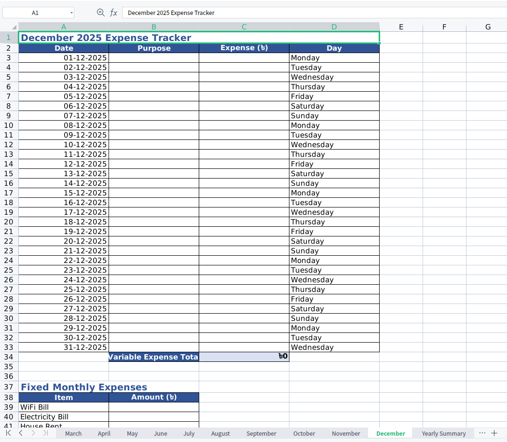
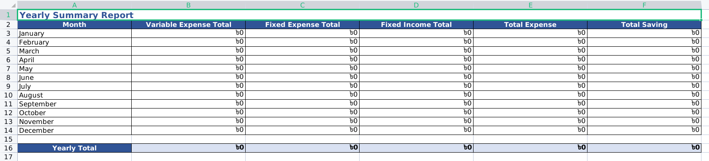

# 📊 Family Budget Excel Generator

This is a simple and powerful **FastAPI + TailwindCSS** based web app to help you and your family track **monthly and yearly budgets** via automatically generated Excel sheets.

It allows you to:
- Enter a year (e.g., 2025)
- Generate an Excel file with 12 months of sheets
- Track daily expenses, fixed expenses, income, and net calculations
- View a smart Yearly Summary with auto-calculated totals

---

## 🚀 Demo

🌐 [Live Demo](https://family-expense-tracker-kohl.vercel.app/)

📷 Screenshots:



---

## ✨ Features

✅ Generate Excel budget sheets for an entire year  
✅ Track **daily expenses** (with date, purpose, amount)  
✅ Add **fixed monthly expenses** (e.g., rent, bills)  
✅ Record **fixed income** (e.g., salary)  
✅ Auto-calculate:
- Monthly totals
- Net monthly balance
- Yearly totals and summary

✅ Beautiful responsive form UI using **Tailwind CSS**  
✅ Works perfectly on **Vercel**

---

## 📦 Tech Stack

- [FastAPI](https://fastapi.tiangolo.com/)
- [Jinja2 Templates](https://jinja.palletsprojects.com/)
- [Tailwind CSS](https://tailwindcss.com/) (via CDN)
- [xlsxwriter](https://xlsxwriter.readthedocs.io/) for Excel generation
- Deployed on **Vercel**

---

## ⚙️ Installation

### 1. Clone the repository

```bash
git clone https://github.com/hr-sobuj/family-expense-tracker.git
cd family-expense-tracker
````

### 2. Create and activate virtual environment

```bash
python -m venv venv
source venv/bin/activate  # For Windows: venv\Scripts\activate
```

### 3. Install dependencies

```bash
pip install -r requirements.txt
```

### 4. Run the app

```bash
uvicorn main:app --reload
```

Now go to `http://localhost:8000` in your browser.

---

## 📁 Project Structure

```
family-budget-tracker/
│
├── main.py                # FastAPI app
├── excel_generator.py     # Excel creation logic
├── templates/
│   └── index.html         # Tailwind CSS form UI
├── static/
│   └── style.css          # (Optional) extra styles
├── requirements.txt
├── .gitignore
├── README.md
└── vercel.json            # Vercel config
```

---

## 🧾 License

MIT License — feel free to use or modify this project.

---

## 🙋 Author

Built by **\Habibur Rahman**
Want to collaborate or improve it? Feel free to open a PR or contact me!
